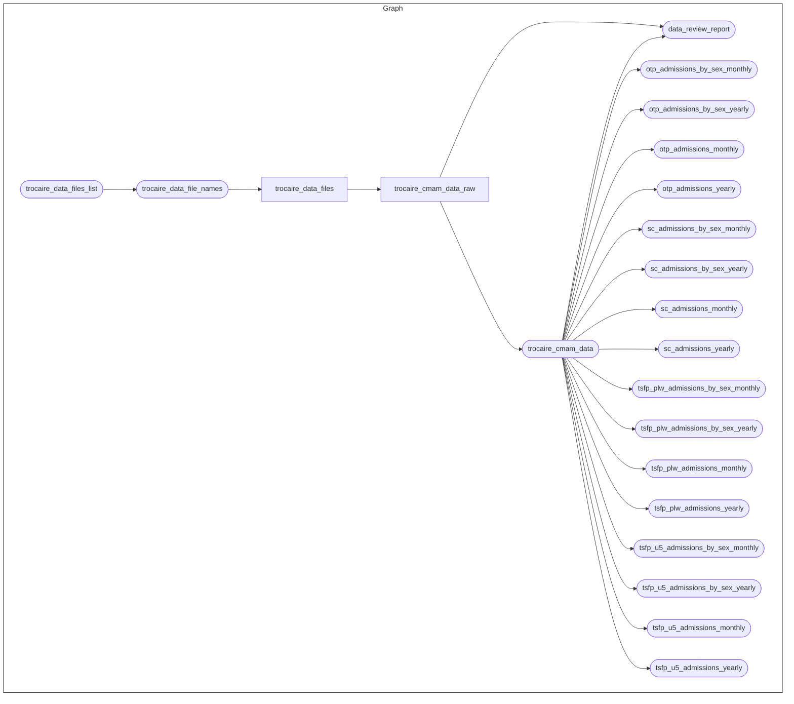

<!-- README.md is generated from README.Rmd. Please edit that file -->

# Trocaire Somalia Community-based Management of Acute Malnutrition (CMAM) Analytics <a href="https://www.tropicalmedicine.ox.ac.uk/study-with-us/msc-ihtm" target="_blank"></a> <a href="https://www.trocaire.org/" target="_blank"></a>

<!-- badges: start -->

[-GPL3.0-blue.svg)](https://opensource.org/licenses/gpl-3.0.html)
[-CC_BY_4.0-blue)](https://creativecommons.org/licenses/by/4.0/)
[](https://github.com/OxfordIHTM/trocaire-cmam-analytics/actions/workflows/test-targets-workflow.yml)
<!-- badges: end -->

This repository is a template for a
[`docker`](https://www.docker.com/get-started)-containerised,
[`{targets}`](https://docs.ropensci.org/targets/)-based,
[`{renv}`](https://rstudio.github.io/renv/articles/renv.html)-enabled
[`R`](https://cran.r-project.org/) workflow for analytics of
[Trócaire](https://www.trocaire.org/)’s Community-based Management of
Acute Malnutrition (CMAM) programme in Somalia.

## About the Project

Malnutrition in Somalia is among the highest globally, with around
903,000 children affected, including 150,000 who are severely
malnourished. Trócaire addresses this by screening and treating children
under five, providing nutrition supplements, and promoting better
feeding and hygiene practices among pregnant and nursing mothers. They
also train caregivers to identify and refer malnourished children for
timely treatment.

This repository contains workflows that process and analyse Trócaire’s
community-based management of acute malnutrition (CMAM) routine
programme data.

## Repository Structure

The project repository is structured as follows:

    trocaire-cmam-analytics
        |-- .git-crypt/
        |-- .github/
        |-- auth/
        |-- data/
        |-- data-raw/
        |-- outputs/
        |-- R/
        |-- reports
        |-- renv
        |-- renv.lock
        |-- .Rprofile
        |-- .env
        |-- .gitattributes
        |-- packages.R
        |-- _targets.R

  - `.git-crypt/` contains `git-crypt` software specific files to manage
    encryption of specific files and folders in the repository.

  - `.github` contains project testing and automated deployment of
    outputs workflows via continuous integration and continuous
    deployment (CI/CD) using Github Actions.

  - `auth` contains encrypted authentication keys used in this project.

  - `data/` contains intermediate and final data outputs produced by the
    workflow.

  - `data-raw/` contains raw datasets, usually either downloaded from
    source or added manually, that are used in the project.

  - `outputs/` contains compiled reports and figures produced by the
    workflow.

  - `R/` contains functions developed/created specifically for use in
    this workflow.

  - `reports/` contains literate code for R Markdown and/or Quarto
    reports rendered in the workflow.

  - `renv/` contains `renv` package specific files and directories used
    by the package for maintaining R package dependencies within the
    project. The directory `renv/library`, is a library that contains
    all packages currently used by the project. This directory, and all
    files and sub-directories within it, are all generated and managed
    by the `renv` package. Users should not change/edit these manually.

  - `renv.lock` file is the `renv` lockfile which records enough
    metadata about every package used in this project that it can be
    re-installed on a new machine. This file is generated by the `renv`
    package and should not be changed/edited manually.

  - `.Rprofile` file is a project R profile generated when initiating
    `renv` for the first time. This file is run automatically every time
    R is run within this project, and `renv` uses it to configure the R
    session to use the `renv` project library.

  - `.env` is an encrypted file that contains environment variables used
    in this project.

  - `.gitattributes` file contains information used by `git-crypt` to
    determine which files and/or folders in the repository to encrypt.

  - `packages.R` file lists out all R package dependencies required by
    the workflow.

  - `_targets.R` file defines the steps in the workflow’s data ingest,
    data processing, data analysis, and reporting pipeline.

## Reproducibility

### R version

This project was built using `R 4.5.1`. To manage R versions, it is
recommended to use [`rig`](https://github.com/r-lib/rig) - an R
installation manager - to be able to install multiple versions of R and
switch between them as needed.

### R package dependencies

This project uses the `{renv}` framework to record R package
dependencies and versions. Packages and versions used are recorded in
`renv.lock` and code used to manage dependencies is in the `renv`
directory and other files in the root project directory.

On starting an R session in the working directory of this repository,
first run

``` r
renv::restore()
```

to install R package dependencies.

### Encryption

This project uses encrypted environment variables and authentication
keys for data retrieval managed using
[`git-crypt`](https://github.com/AGWA/git-crypt). Collaborators will
need to install `git-crypt` and then provide their GPG key to the
authors to be added as an authorised user within the repository. To get
a GPG key, [download and install GPG](https://www.gnupg.org/download/)
and then [generate your GPG key
pair](https://www.gnupg.org/gph/en/manual/c14.html). Then provide your
GPG key id to the authors.

### The workflow



## Authors

  - Bisharo Europe Maalim
  - Proochista Ariana
  - Ernest Guevarra

## License

All code in this workflow is released under a GPL-3.0 license. All text
and reports in this handbook is released under a CC-BY-4.0 license.
